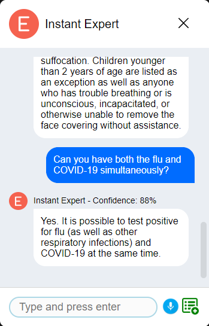
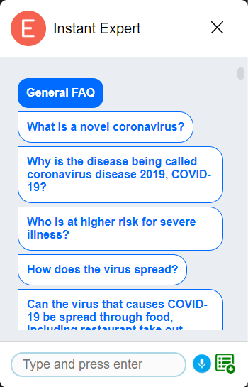
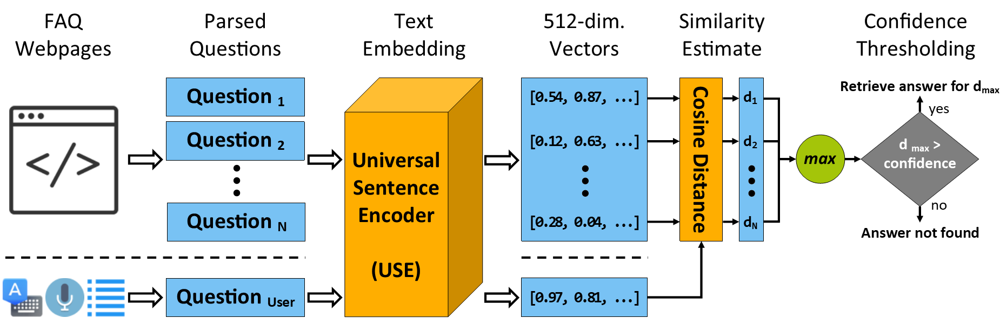
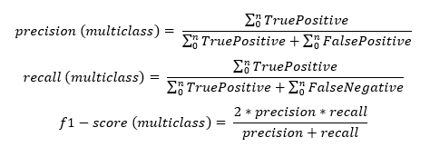
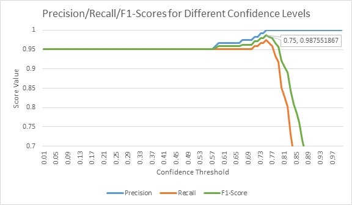
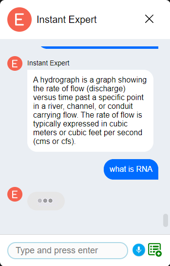
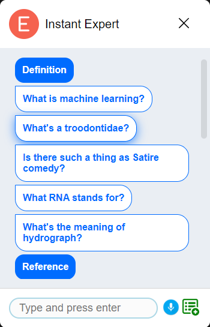

<p align="center"></p>

<!--
<h1 align="center">  </h1> <br>
<p align="center">
  
</p>-->

<h3 align="center">
  A Semantic Web Framework for Automated Smart Assistants
</h3>

<br>

## Table of Contents

- [Introduction](#introduction)
- [How To Use](#how-to-use)
  - [Q&A Mode](#qa-mode)
  - [Knowledge Engine Mode](#knowledge-engine-mode)
- [Use Cases](#use-cases)
  - [Q&A Mode - COVID-19 Case Study](#covid-19-case-study)
  - [Knowledge Engine Mode - Microsoft Cognitive Services - Project Answer Search](#microsoft-cognitive-services---project-answer-search)
- [Supported Browsers](#supported-browsers)
- [Feedback](#feedback)
- [License](#license)
- [Acknowledgements](#acknowledgements)

## Introduction

This project presents the Instant Expert, an open-source web framework to build and integrate voice-enabled smart assistants (i.e. chatbots) for any web platform regardless of the underlying domain and technology. The component allows web developers to incorporate an operational chatbot into their websites by simply adding as little as a single line of HTML code while customizations are enabled for more advanced use cases. The component entails an encapsulated user interface, that accepts natural language questions via text and speech inputs as well as selection from a predefined list of questions, and a knowledge generation module that processes a question to map it to the configured data resource and return the answer. Instant Expert is capable of automatically parsing, processing, and modeling internal (same-origin) or external (cross-origin) Frequently Asked Questions (FAQ) webpages as an information resource as well as communicating with an external knowledge engine for ontology-powered inference and dynamic data utilization. The presented framework is powered by advanced web technologies to ensure reusability and reliability and by deep learning to perform accurate natural language mappings. A use case for creating an informatory chatbot for COVID-19 based on the Centers for Disease Control and Prevention (CDC) data is presented to demonstrate the framework’s usage and benefits. The framework can operate completely on the client-side ensuring data privacy and can especially be valuable for individual developers, academic research groups, small companies, non-profits, and public offices that may not have the resources for the development and maintenance of commercial smart assistants for their organization.

For the full publication, please visit [https://arxiv.org/abs/2007.00747](https://arxiv.org/abs/2007.00747).

Conversation Screen | List of Example Questions
:-------------------------:|:-------------------------:
  |  

## How To Use

The InstantExpert do not require any frameworks and can be integrated into any website using pure HTML. To use it, please follow the steps below.

- Import the bundled version of Instant Expert as a script.
```html
<script src="dist/instant-expert-dist.js"></script>

<!-- or, you can use a CDN as below -->

<script src="https://cdn.jsdelivr.net/gh/uihilab/instant-expert@master/lib/dist/instant-expert-dist.js"></script>
```

Alternatively, you can download the library to make modifications, and test it by importing InstantExpert as a module-typed script:
```html
<script src="instant-expert.js" type="module"></script>
```

### Q&A Mode

A major motivation of Instant Expert is to augment existing web platforms with a plug-and-play importable web component with minimal effort. In most use cases, static and textual responses can suffice to help users find useful information that they were in pursuit of. Such pieces of information are often presented in a web platform in the form of Frequently Asked Questions (FAQ). However, searching for information via FAQs is often discouraging, hard to navigate, time-consuming, and results in failure of critical information communication in a timely manner. As a solution, the Q&A Mode of the Knowledge Generation Module is equipped with functionalities to parse and process FAQ pages and to efficiently and effectively map any user question into one of the question and answer couples in the generated knowledge base. Thus, the Instant Expert effortlessly enhances user experience by allowing the users to verbally communicate with the system and receive a direct response without the hassle of going through potentially hundreds of frequently asked questions. Figure below visualizes the workflow for the Q&A Mode.



#### FAQ from a web page

The Instant Expert can be initialized in the FAQ mode by providing a URL for an FAQ webpage as the source. Due to the cross-origin limitations, a proxy server (CORS Anywhere) needs to be utilized to retrieve the webpage contents. 

If the developer enabled ```downloadModel``` attribute of the Instant Expert element, then the framework will generate a JSON file consisting of the tensor matrix and the Q&A couples. This JSON file can be hosted on a server and the URL to access the file can be provided to Instant Expert, as shown [in section 'FAQ from a Model'](#faq-from-a-model-recommended)

```html
<instant-expert 
    mode="faq-web" 
    faq-url="YourProxyURL/https://www.cdc.gov/coronavirus/2019-ncov/faq.html">
</instant-expert>
```

#### FAQ from a custom list

Some use cases may require manual definition of question and answers instead of having or relying on an existing FAQ webpage. To enable such initialization, the Instant Expert presents a mode, called faq-custom, in which HTML Slot elements are utilized to allow the developer to specify questions and their corresponding answers as shown below.

```html
<instant-expert mode="faq-custom">
    <div slot="questions">
        <p>Question 1</p>
        <p>Question 2</p>
    </div>
    <div slot="answers">
        <p>Answer 1</p>
        <p>Answer 2</p>
    </div>
</instant-expert>
```

#### FAQ from a Model (Recommended)

Most of the parsing and embedding process takes place on the background (i.e. async) to allow users to continue normal operation, however, it still consumes client resources and requires varying time depending on client hardware. Both previous FAQ processing approaches (i.e. web, custom) come with the capability of extracting a JSON file containing the parsed Q&A couples along with their USE embeddings (e.g. a 512-dimensional tensor). This downloaded model file can be provided to the Instant Expert directly to eliminate the time and resources required for FAQ processing. This use case is suggested as the default method to ensure the users can use the chatbot immediately after the page is loaded. Since no new processing is done, the precision and recall values are the same as reported above. Example usage is presented below.

```html
<instant-expert 
    mode="faq-model" 
    faq-url="instantexpert_faq_cdc.json">
</instant-expert>
```

### Knowledge Engine Mode

- Include the web component <instant-expert> in your html and set the 'engine' to your webhook:
```html
<instant-expert id="bing-expert" engine="https://expert-component-example-bing.herokuapp.com/"></instant-expert>
```

That's it! You can now use your virtual expert.

#### Optional Configurations

To add a list of example questions to allow the users to browse the questions that your expert is capable of answering, set the questions and their categories as shown below in JavaScript.

```js
var expert = document.getElementById("bing-expert");
var questionList = [
                      ["What is machine learning?",               "Definition"],
                      ["What's a troodontidae?",                  "Definition"],
                      ["Is there such a thing as Satire comedy?", "Definition"],
                      ["What RNA stands for?",                    "Definition"],
                      ["What's the meaning of hydrograph?",       "Definition"],

                      ["Which algorithms have been used for predictive modeling?",    "Reference"],
                      ["How many medals did the US win in the 2012 summer Olympics?", "Reference"],
                      ["When did Berlin host the Olympics?",                          "Reference"],
                      ["Who played Morpheus in The Matrix",                           "Reference"],
                      ["How tall is Barack Obama?",                                   "Reference"],

                      ["How to find happiness?",                  "Conversational/Fun"],
                      ["What's the first rule of Fight Club?",    "Conversational/Fun"],
                      ["What does the fox say",                   "Conversational/Fun"],
                      ["Can you pass the Turing test?",           "Conversational/Fun"],
                      ["How much wood could a woodchuck chuck, if a woodchuck could chuck wood?", "Conversational/Fun"]
                   ];
expert.setQuestions(questionList);
```

There are a number of attributes to customize the InstantExpert web component which below table summarizes.

| Attribute Name      | Expected Value | Description  |
| -------------       |:-------------: | :------------|
| engine              | string         | The webhook link that will be used to make a POST request to get the answer for user's question. The question text will be passed with the parameter named "searchValue". As the response, it expects a JSON file with the the field "resultText" |
| engineDataKey       | string         | The key name to pass the question text to the engine. The question will be passed to the engine as a parameter with a POST request in this format: {engineDataKey: questionText}. The default is 'question'.|
| engineResponseKey   | string         | The key name to access the answer text in the JSON object returned by the engine. The default is 'resultText'.|
| logo-src            | string         | The link for the source of the logo. |
| logo-hidden         | boolean        | Toggle logo's visibility. True=visible, false=hidden |
| textbox-placeholder | string         | The placeholder text that will be displayed on the input text box. |
| no-question-list    | boolean        | Disable the question list. If true, question list will not be displayed. |
| no-voice            | boolean        | Disable voice input. If true, voice input will be disabled.  |
| expert-button-src   | string         | The link for the source of the always-visible button to toggle the expert component. |

##### Notes

* The link of the 'engine' webhook should use 'https' if voice-input is desired. If not, regular 'http' connection can be used.
* If the HTTP request to the webhook needs modification, we encourage you to modify the source code of the Instant Expert Web Component and use it as you please.

## Use Cases

### Q&A Mode

#### COVID-19 Case Study
An information dissemination chatbot for COVID-19 has been developed to demonstrate the presented framework’s usage and benefits due to the urgent demand as COVID-19 pandemic is progressing. According to web analytics service (SimilarWeb, 2020), the CDC website has received the highest number of visits (i.e. traffic) among websites that are served in English and that offer information and statistics on the spread of the COVID-19 infection. Thus, we have selected the [CDC’s official Frequently Asked Questions webpage](https://www.cdc.gov/coronavirus/2019-ncov/faq.html) as a source for the following use cases. On that page, there is a total of 119 questions spanning various topics ranging from COVID-19 basics to cleaning and disinfection as of June 20, 2020. Exactly all of these 119 Q&A items on the CDC page have successfully been extracted with a 100% precision and recall with Instant Expert's heuristic parsing algorithm.

- To test this example by yourself, navigate to [examples/faq/faq-model/cdc](examples/faq/faq-model/cdc) and run *index.html* on supported browsers.

Conversation Screen | List of Example Questions
:-------------------------:|:-------------------------:
  |  

As a way to quantify how flexible the Instant Expert is in terms of accurately mapping question variations that share the same intent, a test set is generated. The test set contains the original FAQ question, answer, and one natural language question that expects the same answer with different phrasing. For objectivity, a third-party software (i.e. QuillBot), which is a machine learning-powered paraphraser and sentence restructurer, is utilized to produce high-variance natural language questions with a similar meaning to the original. Additionally, the test set also contains three questions that the CDC’s FAQ cannot and should not answer, taken from the US Federal Drug Administration’s (FDA) FAQ webpage. For measurements, a benchmark code has been written to experiment with a broad range of confidence threshold values with respect to the precision and recall values. Both the benchmark code and a complete test set can be found [examples/faq/_benchmark](examples/faq/_benchmark).

In order to quantify the model’s effectiveness, precision, recall, and f1-score metrics have been selected for this imbalanced classification problem with multiple classes as formulated below (Sokolova and Lapalme, 2009).



Precision, recall, and f1-score values for different confidence thresholds based on generated test data is shown below.



### Knowledge Engine Mode (External)

#### Microsoft Cognitive Services - Project Answer Search
We have developed an open-source example use case to use Expert Web Component to ask natural language questions to get factual responses using [the Project Answer Search by Microsoft Cognitive Services Lab](https://labs.cognitive.microsoft.com/en-us/project-answer-search).

- To test this example by yourself, navigate to [examples/engine/bing-bot/use-case](examples/engine/bing-bot/use-case) and run *index.html* on supported browsers.
  - It uses an engine that is hosted on Heroku for free, and it is subject to limitations.
  - The first time a question is asked, system might take few seconds to wake up Heroku. After that, the responses should be instantaneous.
  - It is only intended for demonstration purposes, and not advised and allowed for production use.
  
- To modify/host this example yourself, please follow the directions on [examples/engine/bing-bot/bot-source](examples/engine/bing-bot/bot-source)

Conversation Screen | List of Example Questions
:-------------------------:|:-------------------------:
  |  

## Supported Browsers

The presented web component is supported by default in;

- Google Chrome
- Mozilla Firefox
- Opera
- Safari
- Microsoft Edge

The speech recognition is only supported in Google Chrome, Opera, and Microsoft Edge.

Sources: [Mozilla](https://developer.mozilla.org/en-US/docs/Web/Web_Components), [W3Counter](https://www.w3counter.com/globalstats.php), [Can I Use Speech Recognition](https://caniuse.com/#search=speech)

## Feedback

Feel free to send us feedback by filing an issue.

## License

This project is licensed under the MIT License - see the [LICENSE](LICENSE) file for details.

## Acknowledgements

This project is developed by the University of Iowa Hydroinformatics Lab (UIHI Lab): [https://hydroinformatics.uiowa.edu/](https://hydroinformatics.uiowa.edu/).
