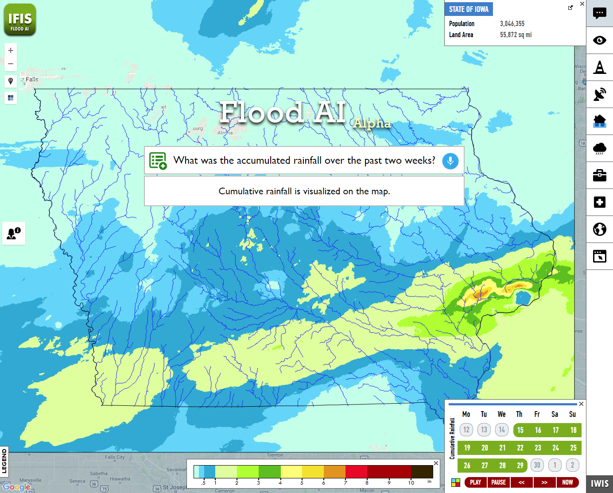
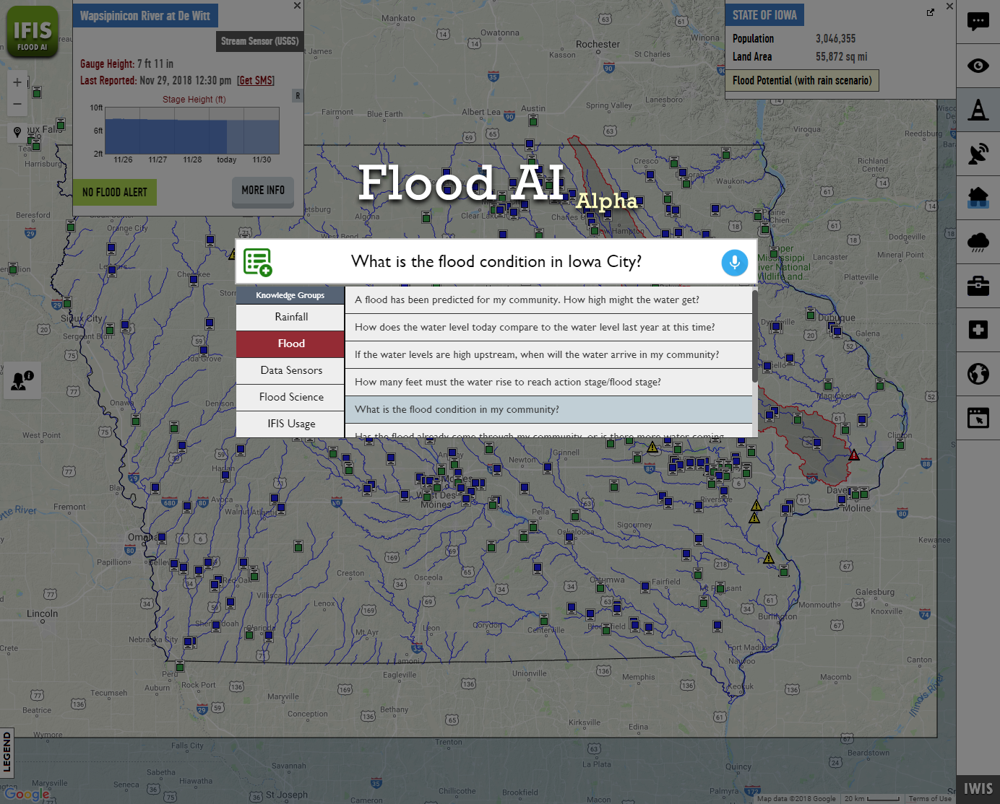

<p align="center"></p>

<!--
<h1 align="center">  </h1> <br>
<p align="center">
  
</p>-->

<h3 align="center">
  A Generalized Web Component for Domain-Independent Smart Assistants
</h3>

<br>

## Table of Contents

- [Introduction](#introduction)
- [How To Use](#how-to-use)
- [Use Cases](#use-cases)
  - [Microsoft Cognitive Services - Project Answer Search](#microsoft-cognitive-services---project-answer-search)
  - [The Flood Expert](#the-flood-expert)
- [Supported Browsers](#supported-browsers)
- [Feedback](#feedback)
- [License](#license)
- [Acknowledgements](#acknowledgements)
- [References](#references)

## Introduction

This project introduces the Instant Expert; a lightweight web component that will allow the stable and efficient integration of a natural language question answering system to web-based information systems in any domain. The component consists of the user input (i.e. text, voice, multi-selection), question processing, and user interface modules. Two use cases are developed and provided to demonstrate the component’s features, benefits, and usage. The goal of this project is to pave the way for next-generation information systems by mitigating the challenges of developing voice-enabled and domain-informed smart assistants for the associates of any domain.

For the complete paper, please visit [https://arxiv.org/abs/1909.02507](https://arxiv.org/abs/1909.02507)

## How To Use

The InstantExpert do not require any frameworks and can be integrated into any website using pure HTML. To use it, please follow the steps below.

- Download the library and import InstantExpert as a script:
```html
<script src="lib/instant-expert.js" type="text/javascript"></script>
```

- Include the web component <instant-expert> in your html and set the 'engine' to your webhook:
```html
<instant-expert id="bing-expert" engine="https://expert-component-example-bing.herokuapp.com/"></instant-expert>
```

That's it! You can now use your virtual expert.

### Optional Configurations

To add a list of example questions to allow the users to browse the questions that your expert is capable of answering, set the questions and their categories as shown below in JavaScript.

```js
var expert = document.getElementById("bing-expert");
var questionList = [
                      ["What is machine learning?",               "Definition"],
                      ["What's a troodontidae?",                  "Definition"],
                      ["Is there such a thing as Satire comedy?", "Definition"],
                      ["What RNA stands for?",                    "Definition"],
                      ["What's the meaning of hydrograph?",       "Definition"],

                      ["Which algorithms have been used for predictive modeling?",    "Reference"],
                      ["How many medals did the US win in the 2012 summer Olympics?", "Reference"],
                      ["When did Berlin host the Olympics?",                          "Reference"],
                      ["Who played Morpheus in The Matrix",                           "Reference"],
                      ["How tall is Barack Obama?",                                   "Reference"],

                      ["How to find happiness?",                  "Conversational/Fun"],
                      ["What's the first rule of Fight Club?",    "Conversational/Fun"],
                      ["What does the fox say",                   "Conversational/Fun"],
                      ["Can you pass the Turing test?",           "Conversational/Fun"],
                      ["How much wood could a woodchuck chuck, if a woodchuck could chuck wood?", "Conversational/Fun"]
                   ];
expert.setQuestions(questionList);
```

There are a number of attributes to customize the InstantExpert web component which below table summarizes.

| Attribute Name      | Expected Value | Description  |
| -------------       |:-------------: | :------------|
| engine              | string         | The webhook link that will be used to make a POST request to get the answer for user's question. The question text will be passed with the parameter named "searchValue". As the response, it expects a JSON file with the the field "resultText" |
| engineDataKey       | string         | The key name to pass the question text to the engine. The question will be passed to the engine as a parameter with a POST request in this format: {engineDataKey: questionText}. The default is 'question'.|
| engineResponseKey   | string         | The key name to access the answer text in the JSON object returned by the engine. The default is 'resultText'.|
| logo-src            | string         | The link for the source of the logo. |
| logo-hidden         | boolean        | Toggle logo's visibility. True=visible, false=hidden |
| textbox-placeholder | string         | The placeholder text that will be displayed on the input text box. |
| no-question-list    | boolean        | Disable the question list. If true, question list will not be displayed. |
| no-voice            | boolean        | Disable voice input. If true, voice input will be disabled.  |
| expert-button-src   | string         | The link for the source of the always-visible button to toggle the expert component. |

#### Notes

* The link of the 'engine' webhook should use 'https' if voice-input is desired. If not, regular 'http' connection can be used.
* If the HTTP request to the webhook needs modification, we encourage you to modify the source code of the Instant Expert Web Component and use it as you please.

## Use Cases

### Q&A Mode

### Knowledge Engine Mode (External)

#### Microsoft Cognitive Services - Project Answer Search
We have developed an open-source example use case to use Expert Web Component to ask natural language questions to get factual responses using [the Project Answer Search by Microsoft Cognitive Services Lab](https://labs.cognitive.microsoft.com/en-us/project-answer-search).

- To test this example by yourself, just download [examples/engine/bing-bot/use-case](examples/engine/bing-bot/use-case) and run *index.html* on supported browsers.
  - It uses an engine that is hosted on Heroku for free, and it is subject to limitations.
  - The first time a question is asked, system might take few seconds to wake up Heroku. After that, the responses should be instantaneous.
  - It is only intended for demonstration purposes, and not advised and allowed for production use.
  
- To modify/host this example yourself, please follow the directions on [examples/engine/bing-bot/bot-source](examples/engine/bing-bot/bot-source)

Conversation Screen | List of Example Questions
:-------------------------:|:-------------------------:
  |  

## Supported Browsers

The presented web component is supported by default in;

- Google Chrome
- Mozilla Firefox
- Opera
- Safari
- Microsoft Edge

The speech recognition is only supported in Google Chrome, Opera, and Microsoft Edge.

Sources: [Mozilla](https://developer.mozilla.org/en-US/docs/Web/Web_Components), [W3Counter](https://www.w3counter.com/globalstats.php), [Can I Use Speech Recognition](https://caniuse.com/#search=speech)

## Feedback

Feel free to send us feedback by filing an issue.

## License

This project is licensed under the MIT License - see the [LICENSE](LICENSE) file for details.

## Acknowledgements

This project is developed by the University of Iowa Hydroinformatics Lab (UIHI Lab): [https://hydroinformatics.uiowa.edu/](https://hydroinformatics.uiowa.edu/).

## References

* Demir, I. and Krajewski, W.F., 2013. Towards an integrated flood information system: centralized data access, analysis, and visualization. Environmental Modelling & Software, 50, 77-84
* Sermet, Y., & Demir, I. (2018). An intelligent system on knowledge generation and communication about flooding. Environmental Modelling & Software, 108, 51-60.
